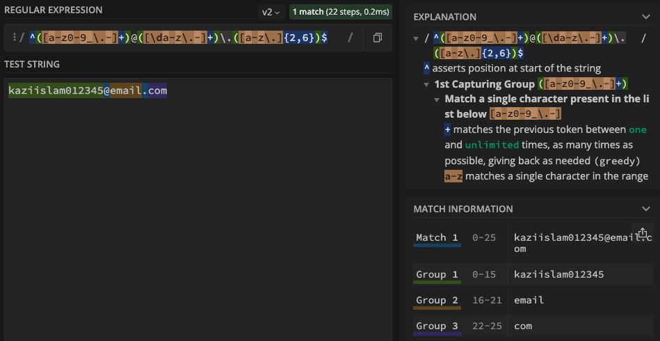
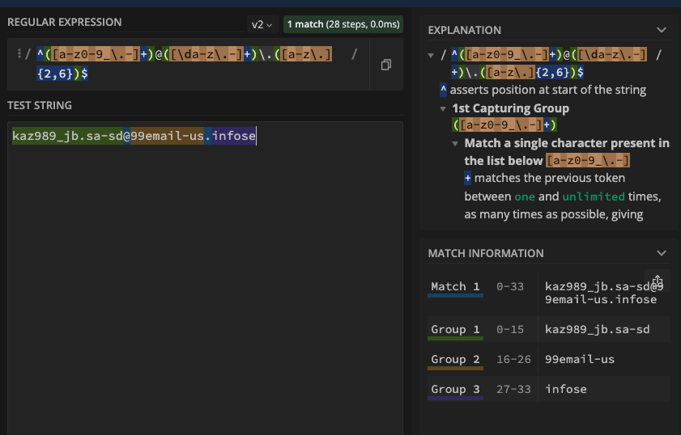

# Regex Tutorial

## Introductory paragraph

From MDN, Regular expressions are patterns used to match character combinations in strings. In JavaScript, regular expressions are also objects. The patterns are used with the exec() and test() methods of RegExp, and with the match(), matchAll(), replace(), replaceAll(), search(), and split() methods of String.

## Summary

This tutorial will use `Matching an Email` `/^([a-z0-9_\.-]+)@([\da-z\.-]+)\.([a-z\.]{2,6})$/` as an example to explain how regex works. Below are break down of each

## Table of Contents

- [Anchors](#anchors)
- [Quantifiers](#quantifiers)
- [Character Classes](#character-classes)
- [Flags](#flags)
- [Grouping and Capturing](#grouping-and-capturing)
- [Bracket Expressions](#bracket-expressions)
- [Greedy and Lazy Match](#greedy-and-lazy-match)
- [Boundaries](#boundaries)
- [Back-references](#back-references)
- [Look-ahead and Look-behind](#look-ahead-and-look-behind)

## Regex Components

### Anchors

`^` and `$` are anchors, they do not match any character; instead they match a position before or after characters. `^` is called `caret` which matches the beginning of the text and `$` `dollar sign` matches the end of the text.

### Quantifiers

A quantifier is appended to a character (or class character) and specifies how many we need. Quantifiers communicate to the regex engine that it must match the quantity of the character or expression. Common quantifier are used in regex `?, +, *, {n}, {n, }`

On the email address above we have
`[a-z0-9_\.-]+` - Matches `group of latters "a-z" number 0-9 underscore(_), dot(.) and hyphen(-) one or more times`
`[\da-z\.-]+` - Matches a `single digit, group of letters a-z, dot(.), or hyphen(-) one or more times`
`[a-z\.]{2,6}` - Matches `2 to 6` copies of the sequence `[a-z\.]`

### Character Classes

Character classes ensure that a given sequence of characters matches a larger set of characters

`[a-z]` - Matches lowercase alphabetic characters between `a through z`
`\d` - Matches a single digit character
`.` - Matches any character

### Flags

Here are few common flags; `g` for global match, `i` for case insensative, `m` for multiline

### Grouping and Capturing

Capturing groups are a way to treat multiple characters as a single unit. They are created by placing the characters to be grouped inside a set of parentheses.

`([a-z0-9_\.-]+)` - Matches `kaz989_jb.sa-sd@email.com`
`([\da-z\.-]+)` - Matches `kaz989_jb.sa-sd@99email-us.com`
`([a-z\.]{2,6})` - Matches `kaz989_jb.sa-sd@99email-us.infose` so after `@domain it will take from 2 to 6 character`

### Bracket Expressions

A bracket expression is either a matching list expression or a non-matching list. It consists of one or more expressions: ordinary characters, collating elements, collating symbols, equivalence classes, character classes, or range expressions.

`[a-z0-9_\.-]`
`[\da-z\.-]`
`[a-z\.]`

### Greedy and Lazy Match

`Greedy` means match longest possible string and `lazy` means match shortest possible string

Example would be `([\da-z\.-]+)` - Matches `kaz989_jb.sa-sd@99email-us.com`

## Screenshots with some examples

## License

[MIT](https://gist.github.com/nicolasdao/a7adda51f2f185e8d2700e1573d8a633#mit-license)

## Author

<strong>Kazi Islam</strong> 
`Github gist` - https://gist.github.com/kazichaska/a80c7b656b597dcbdf9444eac7a0e4c9  
Find me on Github [kazichaska](https://github.com/kazichaska) 
Email me with any question: kazichaska@gmail.com  
